# 생성형 AI 기반 홍보물 제작 서비스
### [SKT FLY AI Challenger 4기] 패기 7조 ASAP 프로젝트 

   
  
   

## 👨🏼‍💻 프로젝트 소개
- 자영업자들이 홍보물 제작 과정에서 겪는 시간과 비용을 절감시켜 주는 서비스
- 사용자가 글과 이미지만 입력하면 현수막, 전단지, SNS게시물 등에서 사용 가능한 다양한 홍보물 이미지를 생성해주는 서비스
    

## 🧑‍🤝‍🧑 팀 구성

|    |  |  |  |  |
| :--------: | :--------: | :-------:| :-----: | :-----: |
|   [정유진](https://github.com/yujin45)   |   [옥창희](https://github.com/okchangheeok)    |  [최지안](https://github.com/choijian) |  [정민수](https://github.com/dbp-jack) |  [이현성](https://github.com/jodog0412) |  
| 팀장, 프론트엔드, 영상처리| 영상처리, AI | 디자인, 백엔드, 프롬프트 튜닝 | 백엔드 | AI, 클라우드|

  
  
## 📅 개발 기간
2024.01.02 ~ 2024.02.28  
[세부 진행사항](https://www.notion.so/b684c938f2414004b22f4a29eef31eaa?v=8b84008e2e6747468475785f07acff46)
    
  
## 🔧 기술 스택
### Frontend

  
  
  

### Backend

  
  

### AI

  
  

    
  
## 🐣 구현 기능

### 1. GPT를 이용한 홍보문구 생성
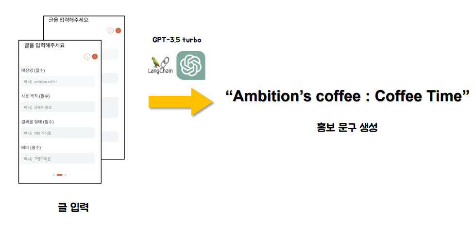

### 2. Dalle, OCR을 이용한 텍스트 이미지 생성 및 정확도 계산
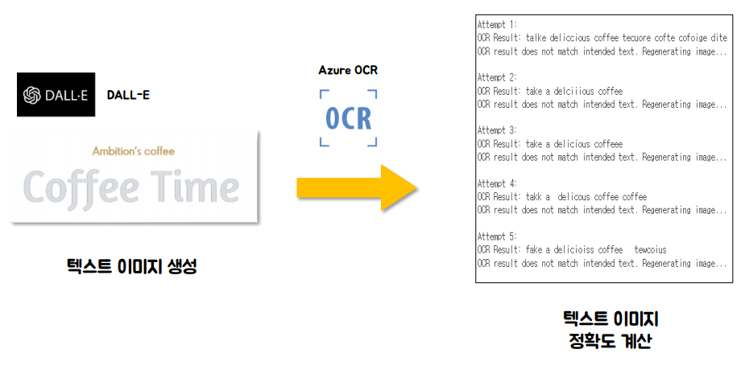
  
### 3. OpenCV, Stable Diffusion을 이용한 배경 이미지 생성
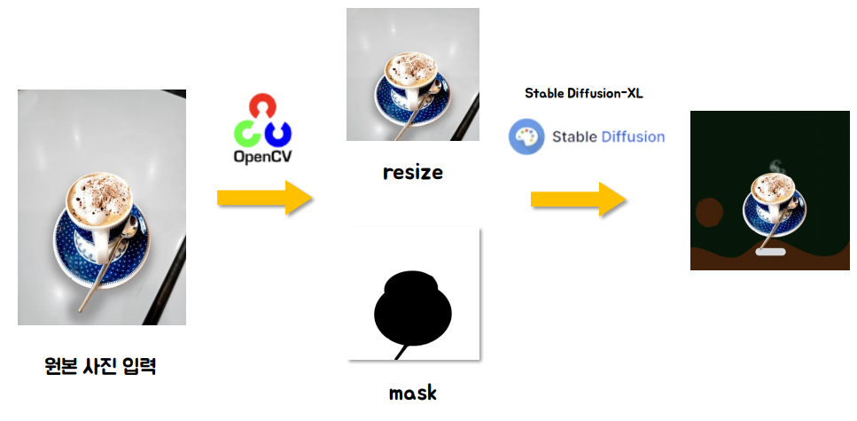
  
### 4. OpenCV를 이용한 마스킹 처리 및 이미지 합성
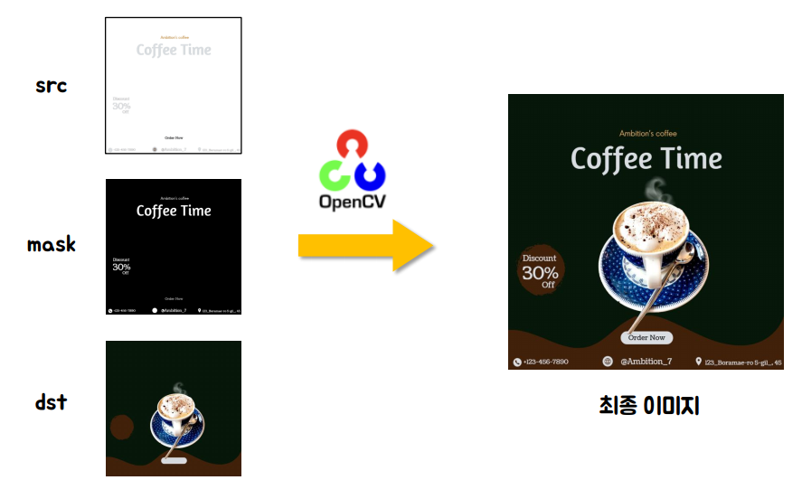
  

## 🎨 화면 구성
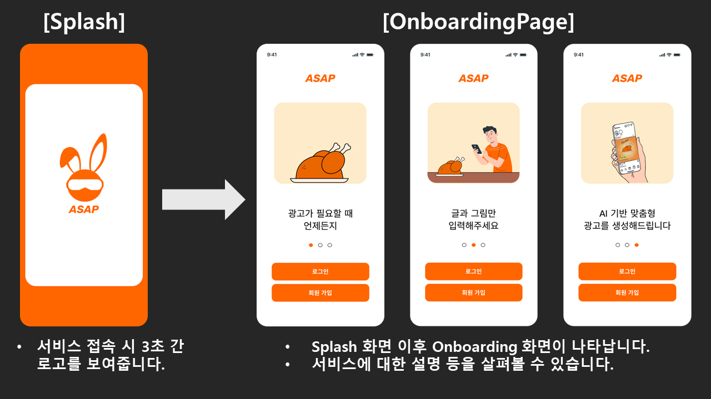
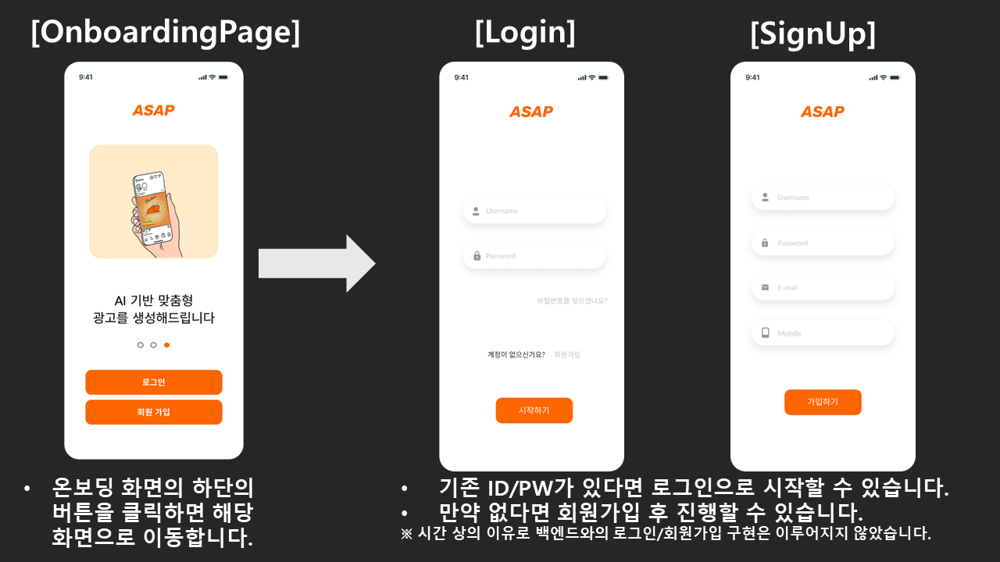
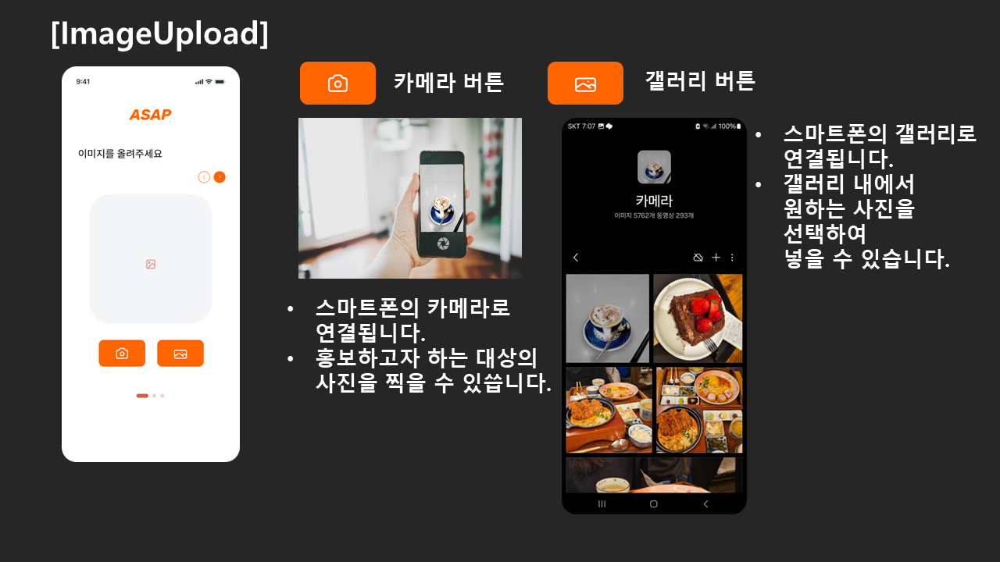
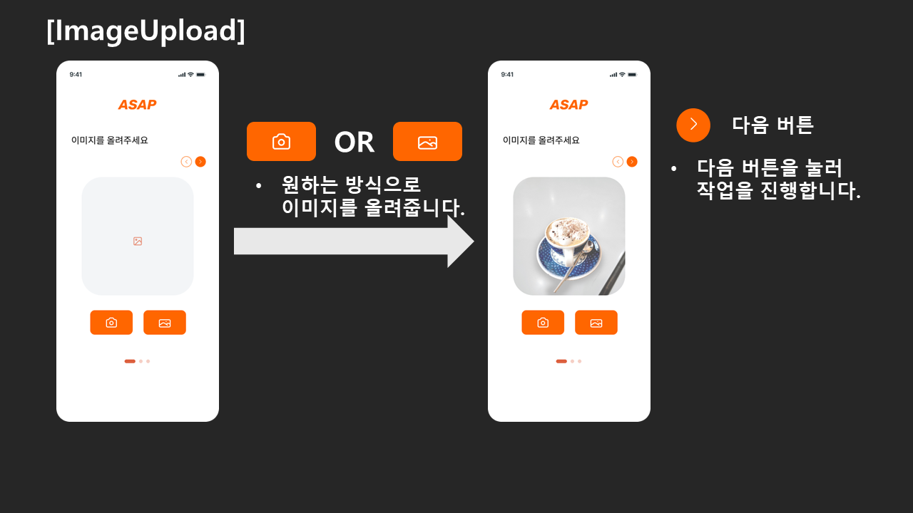
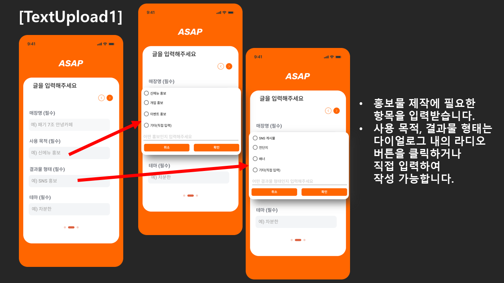
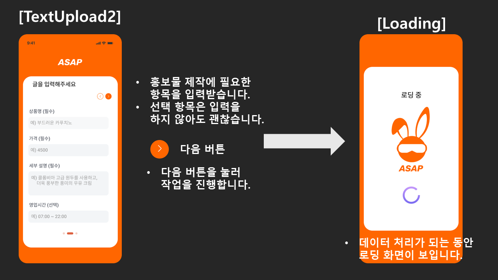
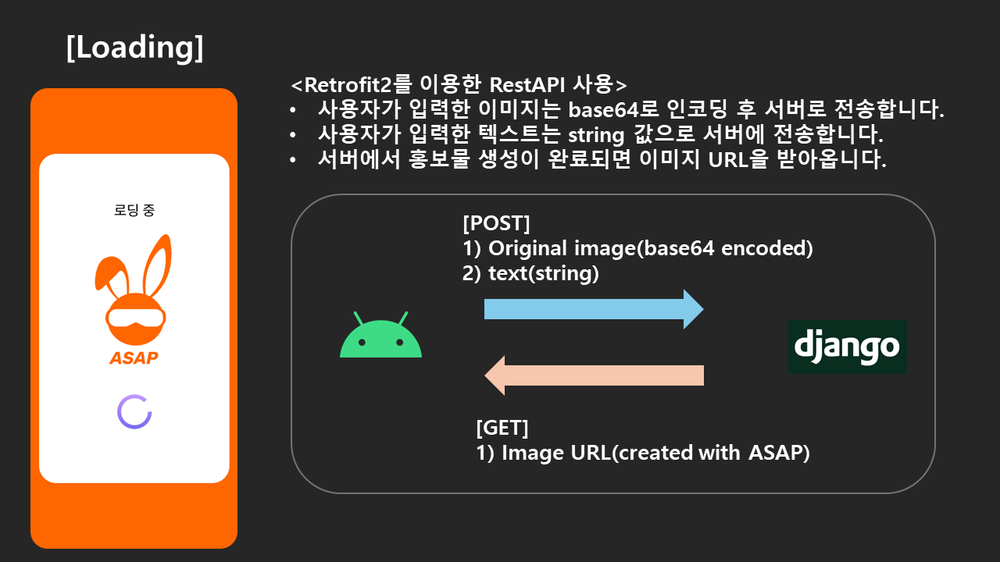
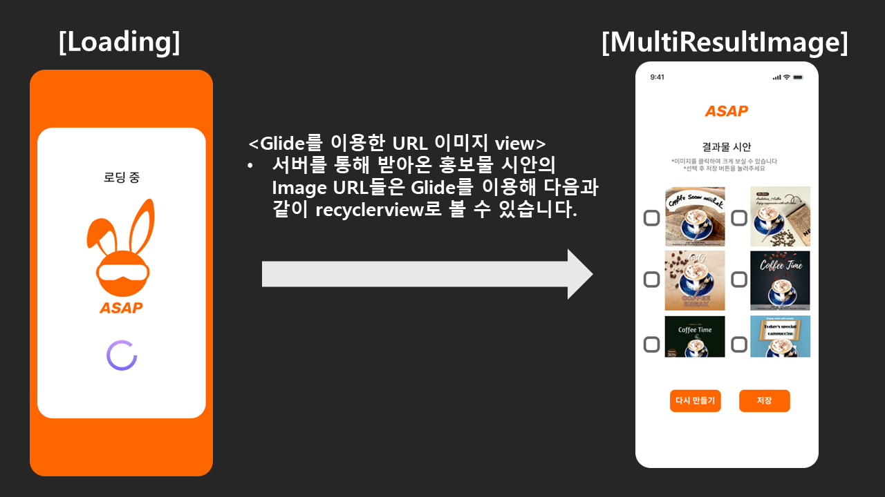
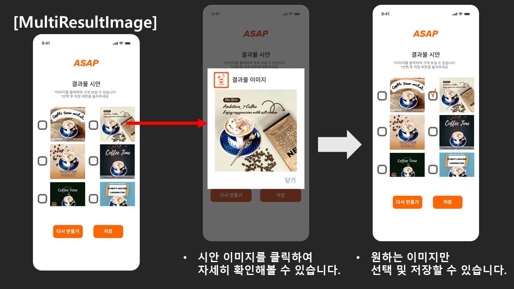
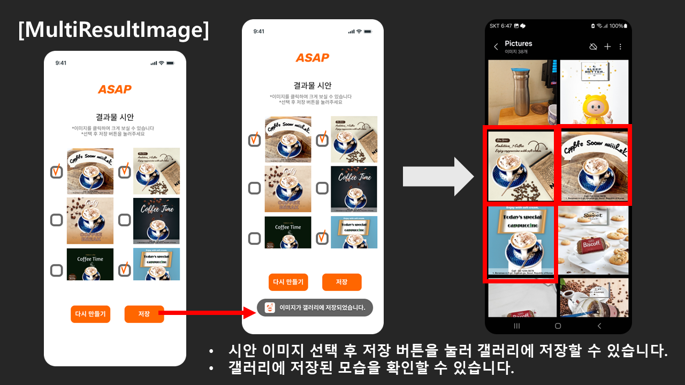
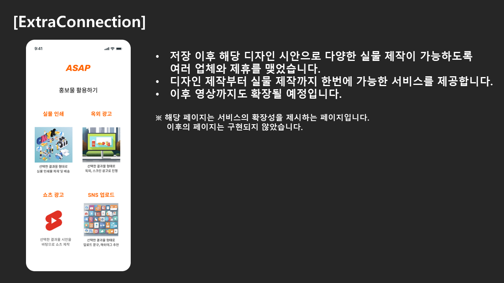

## 기대효과 및 활용방안  
### 🍃 ESG  
- 소상공인 홍보물 제작 지원을 통한 지역경제 활성화
- 공익 캠페인, 국가 등에 홍보물 제작에 지원해 줌으로써 사회 메지 전달이나 특산물 홍보에 기여  

### 💰 비즈니스 모델 
- 인쇄 업체나 옥외광고 업체와 제휴를 맺어 소비자에게 또 하나의 편리한 서비스 프로세스 제공
- 홍보 디자인을 활용할 수 있는 모든 업체와 상호 보완적인 혜택 마련  
  
### 🦄 확장성  
- 사용자로부터 결과물에 대한 피드백을 받아 다음 생성에서 더 높은 퀄리티와 품직을 내도록 AI모델 성능을 개선
- 영상을 자동 생성해주는 API를 이용하여 유튜브 쇼츠 형태로 확장  
